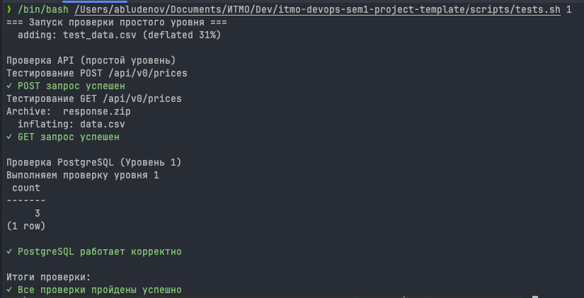
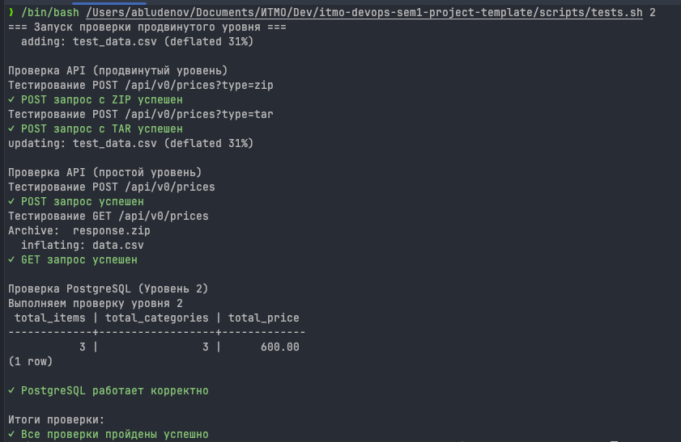
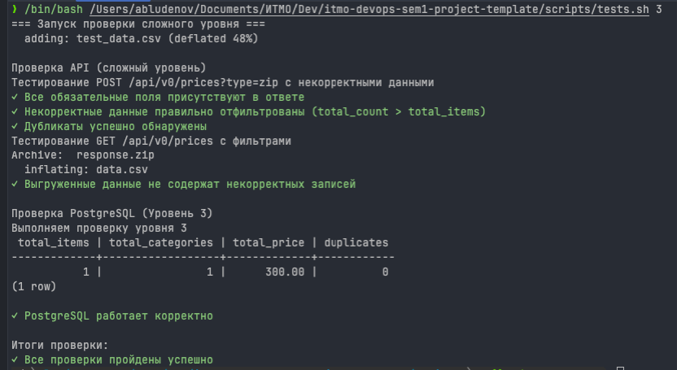
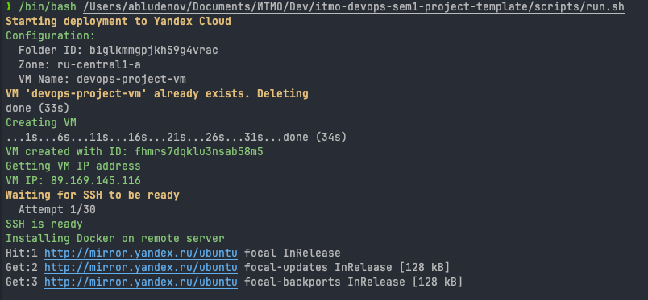
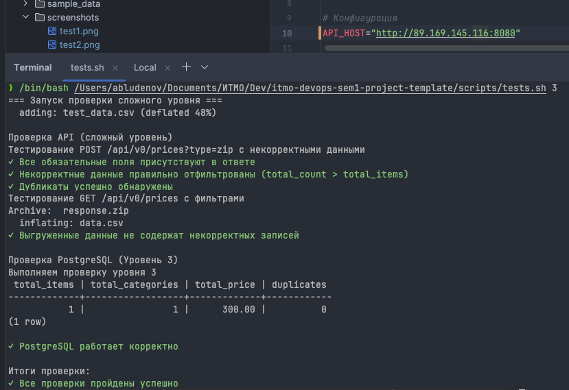

# Финальный проект 1 семестра

REST API сервис для загрузки и выгрузки данных о ценах.

## Требования к системе

    ОС	                Linux
    Процессор	        2 CPU
    Оперативная память	2 ГБ
    Свободное место	        10 ГБ
    Docker	Docker Engine   24+
    Docker Compose	        v2.20+

    Go (для локального запуска без Docker)	1.25

Для деплоя в Yandex Cloud:

    - Установленный yc
    - Созданный профиль через yc init
    - SSH-ключ ~/.ssh/id_rsa.pub
    - Аккаунт с доступом к ус

Подготовка сети в YC:

```bash
    yc vpc network create \
    --name default \
    --folder-id <your-folder-id>
```

```bash
  yc vpc subnet create \
  --name default-ru-central1-a \
  --zone ru-central1-a \
  --range 10.0.0.0/24 \
  --network-name default \
  --folder-id <your-folder-id>
```

## Установка и запуск локально

    1. Клонировать репозиторий
    2. Подготовить .env (пример .env.example)
    3. Запустить docker compose up -d
    4. Api будет доступно по адресу: http://localhost:8080/api/v0/prices

## Тестирование

    ./scripts/tests.sh 1
    ./scripts/tests.sh 2
    ./scripts/tests.sh 3





## Деплой в YC



## Тестирование в YC


## Контакт

Telegram: @aleksandrdb
